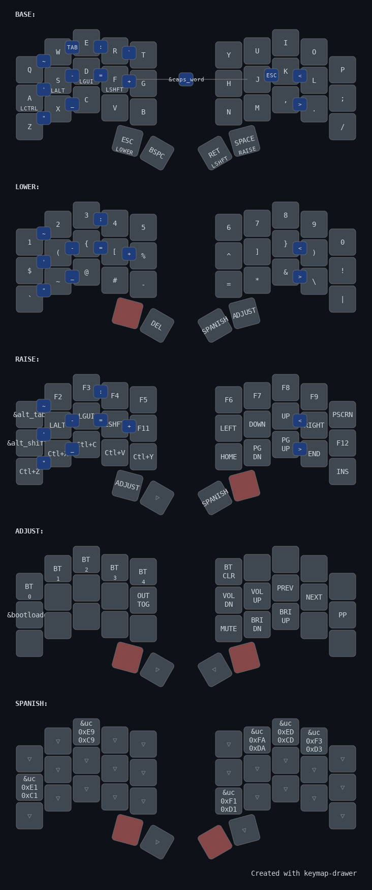

# Urchin ZMK Firmware Configuration

<div align="center">


**Configuración personalizada de ZMK para el teclado Urchin (34 teclas)**

*Optimizada para programación con Neovim y escritura en español*

✨ **Con soporte Unicode nativo para acentos españoles** - Funciona con layout US estándar

[📥 Descargar](#-instalación) •
[📖 Documentación](#-características) •
[🎨 Layout Visual](docs/layout.pdf) •
[🚀 Guía Rápida](QUICK_REFERENCE.md)

</div>

---

## 📸 Vista Previa



---

## 🎯 Características

### Layout de 34 teclas
- 3x5 teclas principales por mano (30 total)
- 2 teclas de pulgar por mano (4 total)

### Capas
1. **BASE**: QWERTY español con home row mods
2. **LOWER**: Números y símbolos de programación
3. **RAISE**: Navegación y teclas de función
4. **ADJUST**: Configuración Bluetooth y media
5. **SpanFish**: Spanish + F-keys - Acentos españoles + F1-F12 en home row (Unicode nativo)

### Home Row Mods
- **Mano izquierda**: A(Ctrl), S(Alt), D(GUI), F(Shift)
- **Mano derecha**: Sin modificadores (optimizado para Neovim - J/K/L libres)

### Combos útiles (Sistema organizado con simetría)

**🔧 Utilidades:**
- **J + K**: ESC (perfecto para salir de modo insertar en Vim)
- **W + E**: TAB
- **F + J** (ambos Shifts): Caps Word

**📝 Comillas (mano izquierda, posiciones análogas):**
- **A + S**: `'` (comilla simple)
- **Z + X**: `"` (comilla doble)

**🔺 Ángulos (mano derecha, posiciones análogas):**
- **K + L**: `<` (HTML tags, comparaciones)
- **, + .**: `>` (HTML tags, comparaciones)

**➖ Guiones (mano izquierda, posiciones análogas):**
- **S + D**: `-` (minus, kebab-case)
- **X + C**: `_` (underscore, snake_case)

**🎯 Símbolos de programación:**
- **D + F**: `=` (igual)
- **F + G**: `+` (más)
- **E + R**: `:` (dos puntos - JSON, CSS)
- **Q + W**: `~` (tilde - regex, paths)
- **R + T**: `` ` `` (backtick - template literals)

**Español + F-keys (Unicode nativo - funciona con layout US estándar):**
- Activa la capa SpanFish manteniendo el pulgar derecho desde LOWER o RAISE
- **Vocales acentuadas minúsculas:**
  - **SpanFish + A** (hold): á
  - **SpanFish + E**: é
  - **SpanFish + I**: í
  - **SpanFish + O**: ó
  - **SpanFish + U**: ú
- **Vocales acentuadas mayúsculas:**
  - **SpanFish + Shift + A** (hold): Á
  - **SpanFish + Shift + E**: É
  - **SpanFish + Shift + I**: Í
  - **SpanFish + Shift + O**: Ó
  - **SpanFish + Shift + U**: Ú
- **Ñ / ñ:**
  - **SpanFish + N**: ñ
  - **SpanFish + Shift + N**: Ñ
- **F-keys (F1-F12 en home row):**
  - **F1-F10**: Home row (A-;)
  - **F11-F12**: Fila inferior (Z, X)
  - **A:** Tap=F1, Hold=á/Á (hold-tap behavior)

## 🚀 Instalación

### 1. Fork este repositorio

Haz fork de este repo en tu cuenta de GitHub.

### 2. Habilita GitHub Actions

Ve a la pestaña "Actions" y habilita los workflows.

### 3. Compila el firmware

El firmware se compilará automáticamente con cada push a `main`. Los archivos `.uf2` estarán disponibles en los artifacts de la acción.

### 4. Flashea el teclado

1. Descarga los archivos `.uf2` de los artifacts
2. Conecta cada mitad del teclado en modo bootloader (doble tap en reset)
3. Arrastra el archivo correspondiente al almacenamiento USB que aparece:
   - `urchin_left_nice_view.uf2` → Mitad izquierda
   - `urchin_right_nice_view.uf2` → Mitad derecha

### 5. Reset de configuración (si es necesario)

Si necesitas resetear la configuración Bluetooth:
1. Flashea `settings_reset.uf2` en ambas mitades
2. Vuelve a flashear el firmware normal

## 📝 Estructura del Proyecto

```
urchin-zmk-config/
├── .github/
│   └── workflows/
│       └── build.yml          # GitHub Actions para compilación automática
├── config/
│   ├── urchin.keymap          # Definición del layout y capas
│   ├── urchin.conf            # Configuración de ZMK
│   └── west.yml               # Dependencias: ZMK + zmk-unicode
├── docs/
│   └── layout.pdf             # Diagrama visual del layout
├── build.yaml                 # Configuración de compilación
└── README.md                  # Este archivo
```

### Módulos externos utilizados

Este proyecto incluye las siguientes dependencias en `config/west.yml`:

- **zmk** (v0.3.0) - Firmware base de ZMK
- **urchin-zmk-module** - Módulo específico del hardware Urchin
- **nice-view-gem** - Soporte para displays nice!view
- **zmk-unicode** (v0.3) - Soporte Unicode nativo para acentos españoles

## 🎨 Layout por capas

### Capa BASE
```
╭─────────────┬─────────────┬─────────────┬─────────────┬─────────────╮   ╭─────────────┬─────────────┬─────────────┬─────────────┬─────────────╮
│      Q      │      W      │      E      │      R      │      T      │   │      Y      │      U      │      I      │      O      │      P      │
├─────────────┼─────────────┼─────────────┼─────────────┼─────────────┤   ├─────────────┼─────────────┼─────────────┼─────────────┼─────────────┤
│   A (Ctrl)  │   S (Alt)   │   D (GUI)   │  F (Shift)  │      G      │   │      H      │      J      │      K      │      L      │      ;      │
├─────────────┼─────────────┼─────────────┼─────────────┼─────────────┤   ├─────────────┼─────────────┼─────────────┼─────────────┼─────────────┤
│      Z      │      X      │      C      │      V      │      B      │   │      N      │      M      │      ,      │      .      │      /      │
╰─────────────┴─────────────┴─────────────┼─────────────┼─────────────┤   ├─────────────┼─────────────┼─────────────┴─────────────┴─────────────╯
                                           │  ESC(LOWER) │     BSPC    │   │ RET (Shift) │ SPC (RAISE) │
                                           ╰─────────────┴─────────────╯   ╰─────────────┴─────────────╯
```

### Capa LOWER (Números y Símbolos - Brackets Simétricos)
```
╭─────────────┬─────────────┬─────────────┬─────────────┬─────────────╮   ╭─────────────┬─────────────┬─────────────┬─────────────┬─────────────╮
│      1      │      2      │      3      │      4      │      5      │   │      6      │      7      │      8      │      9      │      0      │
├─────────────┼─────────────┼─────────────┼─────────────┼─────────────┤   ├─────────────┼─────────────┼─────────────┼─────────────┼─────────────┤
│      $      │      (      │      {      │      [      │      %      │   │      ^      │      ]      │      }      │      )      │      !      │
├─────────────┼─────────────┼─────────────┼─────────────┼─────────────┤   ├─────────────┼─────────────┼─────────────┼─────────────┼─────────────┤
│      `      │      ~      │      @      │      #      │      -      │   │      =      │      *      │      &      │      \      │      |      │
╰─────────────┴─────────────┴─────────────┼─────────────┼─────────────┤   ├─────────────┼─────────────┼─────────────┴─────────────┴─────────────╯
                                           │    ______   │     DEL     │   │  SpanFish   │   ADJUST    │
                                           ╰─────────────┴─────────────╯   ╰─────────────┴─────────────╯

Brackets simétricos: Izquierda abre ( { [ | Derecha cierra ] } )
Brackets en anular/medio/índice (más ergonómico - libera el meñique)
```

### Capa RAISE (Navegación)
```
╭─────────────┬─────────────┬─────────────┬─────────────┬─────────────╮   ╭─────────────┬─────────────┬─────────────┬─────────────┬─────────────╮
│    SUPER    │     F2      │     F3      │     F4      │     F5      │   │     F6      │     F7      │     F8      │     F9      │   PSCRN     │
├─────────────┼─────────────┼─────────────┼─────────────┼─────────────┤   ├─────────────┼─────────────┼─────────────┼─────────────┼─────────────┤
│   ALT+F4    │     Alt     │     GUI     │    Shift    │    F11      │   │      ←      │      ↓      │      ↑      │      →      │    F12      │
├─────────────┼─────────────┼─────────────┼─────────────┼─────────────┤   ├─────────────┼─────────────┼─────────────┼─────────────┼─────────────┤
│  Undo(^Z)   │  Cut(^X)    │ Copy+(^S^C) │Paste+(^S^V) │  Redo(^Y)   │   │    HOME     │   PG_DN     │   PG_UP     │     END     │    INS      │
╰─────────────┴─────────────┴─────────────┼─────────────┼─────────────┤   ├─────────────┼─────────────┼─────────────┴─────────────┴─────────────╯
                                           │   ADJUST    │    ______   │   │  SpanFish   │    ______   │
                                           ╰─────────────┴─────────────╯   ╰─────────────┴─────────────╯

Navegación Ubuntu/GNOME: SUPER (Activities), ALT+F4 (cerrar ventana)
Navegación estilo Neovim (HJKL) en home row derecha
Copy+/Paste+: Ctrl+Shift+C/V (portapapeles del sistema para Neovim)
Print Screen disponible en posición P (RAISE + P)
F1 y F10: Disponibles en capa SpanFish (home row ergonómico)
```

### Capa ADJUST (Bluetooth y Media)
```
╭─────┬─────┬─────┬─────┬─────╮   ╭─────┬─────┬─────┬─────┬─────╮
│ BT0 │ BT1 │ BT2 │ BT3 │ BT4 │   │BTCLR│     │     │     │     │
├─────┼─────┼─────┼─────┼─────┤   ├─────┼─────┼─────┼─────┼─────┤
│BOOT │     │     │     │ OUT │   │ VOL-│ VOL+│ PREV│ NEXT│ PLAY│
├─────┼─────┼─────┼─────┼─────┤   ├─────┼─────┼─────┼─────┼─────┤
│     │     │     │     │     │   │ MUTE│ BRI-│ BRI+│     │     │
╰─────┴─────┴─────┼─────┼─────┤   ├─────┼─────┼─────┴─────┴─────╯
                  │ __  │ __  │   │ __  │ __  │
                  ╰─────┴─────╯   ╰─────┴─────╯
```

### Capa SpanFish (Spanish + F-keys)
```
╭─────────────┬─────────────┬─────────────┬─────────────┬─────────────╮   ╭─────────────┬─────────────┬─────────────┬─────────────┬─────────────╮
│             │             │      é      │             │             │   │             │      ú      │      í      │      ó      │             │
├─────────────┼─────────────┼─────────────┼─────────────┼─────────────┤   ├─────────────┼─────────────┼─────────────┼─────────────┼─────────────┤
│   F1 / á    │     F2      │     F3      │     F4      │     F5      │   │     F6      │     F7      │     F8      │     F9      │    F10      │
│   (tap/hold)│             │             │             │             │   │             │             │             │             │             │
├─────────────┼─────────────┼─────────────┼─────────────┼─────────────┤   ├─────────────┼─────────────┼─────────────┼─────────────┼─────────────┤
│     F11     │     F12     │             │             │             │   │      ñ      │             │             │             │             │
╰─────────────┴─────────────┴─────────────┼─────────────┼─────────────┤   ├─────────────┼─────────────┼─────────────┴─────────────┴─────────────╯
                                           │             │             │   │   [HELD]    │             │
                                           ╰─────────────┴─────────────╯   ╰─────────────┴─────────────╯

Diseño ergonómico: F1-F12 en home row + Acentos españoles
Posición A: Tap=F1, Hold=á/Á (hold-tap behavior - 200ms)
Con Shift: Á É Í Ó Ú Ñ (mayúsculas automáticas)
Unicode nativo - Funciona con layout US estándar
Requiere IBus en Linux (incluido por defecto en Ubuntu)
```


## 🔧 Personalización

Para personalizar el layout:

1. Edita `config/urchin.keymap`
2. Haz commit y push a tu repositorio
3. GitHub Actions compilará automáticamente el nuevo firmware
4. Descarga los archivos `.uf2` de los artifacts y flashea

### Ajustes optimizados para programación

**Configuración actual (`config/urchin.conf`):**
- **Sleep timeout**: 30 minutos (1800000ms) - ideal para largas sesiones
- **Debounce press**: 3ms - balance entre velocidad y estabilidad
- **Debounce release**: 5ms
- **Logging USB**: Desactivado para mayor batería

**Timings del keymap (`config/urchin.keymap`):**
- **Home row mods**: 250ms - balance óptimo para typing rápido
- **Quick tap**: 175ms
- **Combos**: 50ms - activación instantánea
- **Prior idle**: 150ms - previene activaciones accidentales

## 💡 Consejos de Uso

### Para Programación Web
- **HTML/JSX**: Combos `<` (K+L) y `>` (,+.) para tags rápidos
- **JavaScript**:
  - Template literals `` ` `` (R+T)
  - Variables snake_case `_` (X+C) y kebab-case `-` (S+D)
  - Operadores `=` (D+F), `+` (F+G)
- **CSS/JSON**:
  - Comillas `'` (A+S) y `"` (Z+X) accesibles
  - Dos puntos `:` (E+R) para propiedades
- **Brackets simétricos**: Mano izquierda abre `( { [`, mano derecha cierra `] } )`
- **Símbolos de código**: Todos los símbolos necesarios en LOWER con layout ergonómico

### Para Neovim
- El combo **J+K** para ESC es extremadamente útil para salir del modo insertar
- La capa RAISE tiene navegación estilo Neovim (**HJKL**) en el home row
- **Navegación Ubuntu/GNOME**: **Super** (RAISE+Q) abre Activities, **Alt+F4** (RAISE+A) cierra ventana
- **Portapapeles del sistema**: **Ctrl+Shift+C** (RAISE+C) y **Ctrl+Shift+V** (RAISE+V) - perfecto para copiar/pegar entre Neovim y otras aplicaciones
- TAB disponible con combo **W+E** en BASE
- Undo/Redo: **Ctrl+Z** (RAISE+Z) y **Ctrl+Y** (RAISE+B)
- **F-keys**: F1-F12 completas en SpanFish layer (home row ergonómico)

### Para Español

**Configuración del sistema operativo:**

Este teclado usa **Unicode nativo** para generar acentos españoles, lo que significa que funciona con el layout **US estándar** (sin necesidad de US-International).

**Requisitos:**
- **Linux (Ubuntu)**: IBus viene habilitado por defecto ✅
- **Prueba de funcionamiento**: Abre un editor y presiona `Ctrl+Shift+U`, escribe `E1`, presiona `Espacio` → debería aparecer **á**

**Layout recomendado:**
```bash
# Ubuntu/GNOME - Layout US estándar (sin dead keys)
gsettings set org.gnome.desktop.input-sources sources "[('xkb', 'us')]"
setxkbmap -layout us
```

**Cómo escribir acentos:**
1. Mantén presionado **ESC** (activa LOWER) o **SPACE** (activa RAISE)
2. Mantén presionado el **pulgar derecho** (activa SpanFish)
3. Presiona la **vocal** correspondiente
4. Para mayúsculas: agrega **Shift**
5. Para **á** desde A: mantener presionado A (hold-tap behavior)

**Ejemplos:**
- **á**: LOWER + SpanFish + A (hold)
- **Ñ**: RAISE + SpanFish + Shift + N
- **ó**: LOWER + SpanFish + O
- **F1**: LOWER + SpanFish + A (tap rápido)

**Ventajas:**
- ✅ Sin dead keys - Los símbolos `` ` ~ ' " `` aparecen inmediatamente
- ✅ Funciona con layout US estándar
- ✅ Mayúsculas automáticas con Shift
- ✅ No interfiere con la programación

### Home Row Mods
- **Solo mano izquierda** tiene modificadores: A(Ctrl), S(Alt), D(GUI), F(Shift)
- **Mano derecha** sin mods (J/K/L libres para Neovim)
- Los mods se activan manteniendo presionada la tecla (250ms)
- Timing optimizado para typing rápido en largas sesiones
- `hold-trigger-on-release` previene activaciones accidentales al escribir rápido
- Si necesitas más/menos tiempo, ajusta `tapping-term-ms` en el keymap

## 🔗 Enlaces Útiles

### Documentación oficial
- [Documentación oficial de ZMK](https://zmk.dev/)
- [Repositorio oficial de Urchin](https://github.com/duckyb/urchin)
- [Comunidad de ZMK en Discord](https://zmk.dev/community/discord/invite)

### Módulos utilizados
- [zmk-unicode - Soporte Unicode nativo](https://github.com/urob/zmk-unicode)
- [zmk-unicode - Guía de uso](https://anirudh.fi/zmk-unicode)
- [nice-view-gem - Display support](https://github.com/M165437/nice-view-gem)

## 📄 Licencia

MIT License - Ver archivo LICENSE para más detalles.

## 🤝 Contribuciones

¡Las contribuciones son bienvenidas! Si tienes mejoras para el layout o encuentras bugs, no dudes en abrir un issue o pull request.

---

**¡Feliz typing! ⌨️✨**
